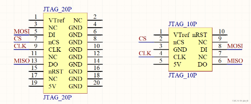

# 使用Jflash SPI烧录外部norflash

> norflash模块可以通过Jflash-SPI直接进行烧录，例如W25Q64系列，或者通过开发板FLM算法烧录，后续更新

## 接线图

手上有一块PY25Q128HA，引脚布局为：

|nCS|1|8|VCC|
|---|---|---|---|
|DO|2|7|nHOLD|
|nWP|3|6|CLK|
|GND|4|5|DI|

n表示低电平有效，WP：硬件写保护，HOLD：暂停操作

- 使用Jflash V7.86，能读取到flash ID，但是提示`error: failed to auto-detection SPI Flash`，需要手动配置参数NumPages:10000(hex), PageSize:100(256Bytes), SectorSize(10000, 即64k)

- 使用Jflash V8.84，可自动识别出芯片型号，无需额外配置

手动接线出来，线序为VCC, GND, DI, CS, CLK, DO, 接到Jlink上，即可烧录

:fontawesome-brands-youtube:{ .youtube }