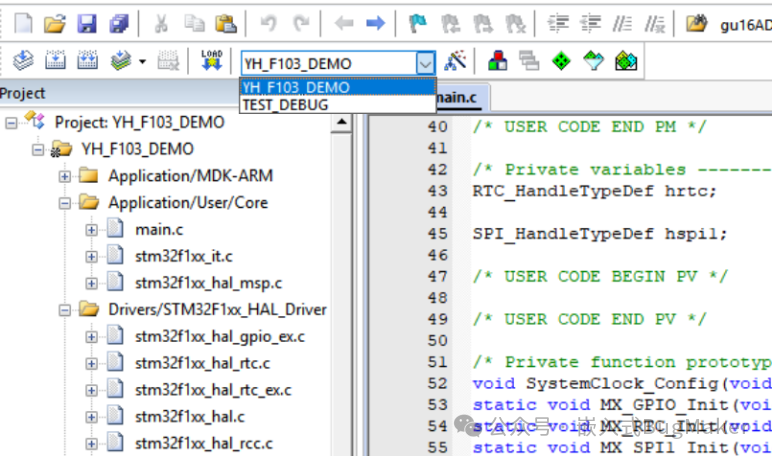

# Project Target用法

> 例如stm32官方例程，存在多种芯片型号，可以在keil工程里面通过target切换工程

## 创建新target
以选中的target为母本创建新的target，两者共用一套文件。


即可在魔术棒左边target下拉栏中看到新增的target


## 配置新target
!!! tip
    - 不同target共用一套文件，增加和删除文件会在所有target中同步执行
    - 每个target的配置都是独立的，这样就可针对不同的设备进行不同的全局define、优化等级、分散加载文件配置、编译配置等差异化配置。
### 不同的Option for target配置
每个target可以通过魔术棒工具进行不同的配置
### 指定参与编译的文件
右键文件/文件夹，在option for file/group中，可通过`include in Target Build`复选框指定文件是否参与编译
### 宏定义在target中的使用
在魔术棒工具`C/C++`中，可在不同target中定义不同的宏，从而对头文件和代码进行条件编译

```c linenums="1"
// 根据芯片系列选择正确的头文件
#if defined(STM32F1)
    #include "stm32f1xx_hal.h"
#elif defined(STM32F4)
    #include "stm32f4xx_hal.h" 
#elif defined(STM32F7)
    #include "stm32f7xx_hal.h"
#endif
// 然后在外设代码中
void GPIO_Config(void) {
    #if defined(STM32F1)
        // F1系列的特殊配置
    #elif defined(STM32F4) || defined(STM32F7)
        // F4/F7系列的配置
    #endif
}
```

编译完成后输出编译信息：  
在魔术棒工具中`User->After Build/Rebuild`，加上以下命令`cmd /c "echo: && echo "Current Define" && echo: "`或者其他脚本文件。  
使用`#pragma message(" ")`不生效，待确认